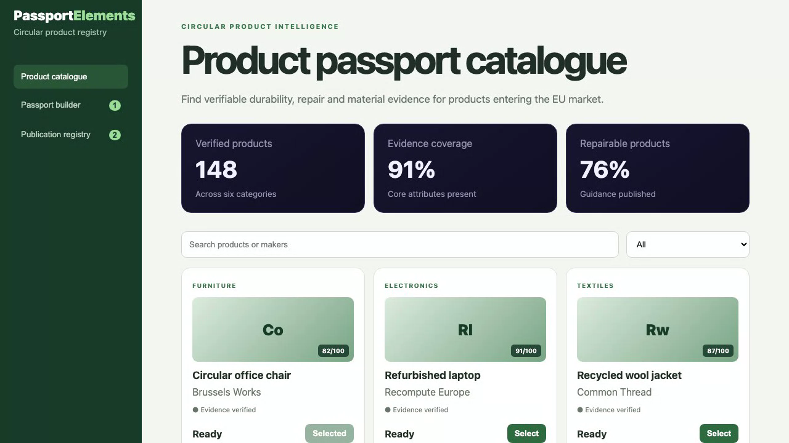

# Product Passport Elements

This project gives clear information about how products are made, repaired, reused, and recycled.

## Live demo

[Watch the recorded product demonstration](docs/demo.webm)

This recording shows the real product running and demonstrates its main screens and actions.

## Screenshots



## Main features

- Search for products.
- Check product and maker information.
- Review repair and material details.
- Select products that need a passport.
- Send information for review.
- Track when a product passport is published.

## Technology used

- Lit and standard Web Components with TypeScript.
- Vite for local development and production builds.
- Java with Spring Boot for the backend.
- Maven for Java builds.
- Vitest and JUnit for automated checks.

## Installation instructions

You need Node.js 20 or newer, Java 21 or newer, and Maven 3.9 or newer.

Install the frontend packages:

```bash
npm ci
```

Run all automated checks and production builds:

```bash
npm test
npm run build
npm run backend:test
npm run backend:build
```

Start the frontend and Java backend together:

```bash
npm run fullstack
```

Open [http://localhost:5173](http://localhost:5173) for the product. The Java API runs at [http://localhost:8080](http://localhost:8080).

## Commercial licensing/contact

No commercial license is granted automatically. For commercial licensing, integration work, consulting, or partnership enquiries, contact [Amitesh2022 through GitHub](https://github.com/Amitesh2022).

## Business problem and users

This project gives clear information about how products are made, repaired, reused, and recycled. It is useful for manufacturers, shops, buyers, repair services, and people checking product information.

## Key workflows

- Search for products.
- Check product and maker information.
- Review repair and material details.
- Select products that need a passport.
- Send information for review.
- Track when a product passport is published.

## Lit and Web Components highlights

The product is made from small, reusable Web Components. Each part keeps its own design and can also work inside React, Vue, Angular, or a normal web page. Automated checks cover the most important actions.

## Java backend highlights

The Java backend uses Spring Boot. It provides real API endpoints to list, search, and create passport task records. It checks incoming information, returns clear errors, exposes a health check, and includes automated Java tests.

## Architecture and state flow

The browser application calls the Java API on port 8080. The Java service checks the request and keeps the shared product information. After a user creates a record, the API returns the saved result and the browser refreshes the list.

## Accessibility and responsive behaviour

Buttons, forms, and links can be used with a keyboard. Labels explain what each field does, and important information is shown with words, not only colours. The layout also adjusts for tablets and phones.
